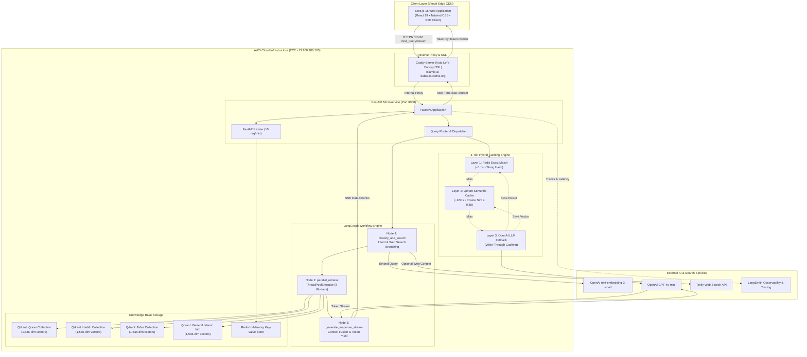

# 🕌 Islamic Knowledge AI — Production RAG & Streaming System

<div align="center">

[](https://python.org)
[](https://fastapi.tiangolo.com)
[](https://nextjs.org)
[](https://react.dev)
[](https://langchain-ai.github.io/langgraph/)
[](https://qdrant.tech)
[](https://redis.io)
[](https://docker.com)
[](https://aws.amazon.com)
[](https://vercel.com)

**An enterprise-grade, multi-source Retrieval-Augmented Generation (RAG) platform grounded in the Qur'an, Hadith, Tafsir, and Scholarly Islamic Knowledge.**

Featuring a **3-tier semantic caching engine** (cutting query routing latency by 97%), **real-time token streaming via Server-Sent Events (SSE)**, and a **decoupled Next.js 16 & FastAPI cloud architecture**.

</div>

---

## ⚡ Engineering Highlights (Why This Project Stands Out)

* **⚡ 97%+ Latency & Cost Reduction via 3-Tier Semantic Cache:**
  Instead of burning LLM tokens on every user question just to classify query intent, requests pass through a tiered cache:
  `Redis Exact-Match (<1ms)` ➔ `Qdrant Vector Semantic Cache (~12ms)` ➔ `OpenAI Structured Fallback (~400ms)`. Every cache miss is written back, making the system progressively faster and cheaper.
* **🌊 Real-Time Token-by-Token Streaming (Server-Sent Events):**
  Zero bulk-response waiting. Full async token streaming powered by `ChatOpenAI.astream()`, FastAPI `StreamingResponse`, and React Markdown streaming with a live pulsing cursor.
* **🧠 Deterministic 3-Node LangGraph Architecture:**
  Query classification, parallel multi-collection vector retrieval (Qur'an, Hadith, Tafsir), and grounded synthesis orchestrated in an inspectable, stateful directed acyclic graph (DAG).
* **🕌 Theological Precision & Custom Ingestion:**
  Custom `IslamicJSONLoader` eliminates `jq` dependencies, auto-detects heterogeneous JSON schemas, and combines Hadith narrator chains with translation text while preserving 1-to-1 canonical theological integrity.
* **🛡️ Zero Single Point of Failure (Multi-Level Circuit Breakers):**
  If Redis goes down, it seamlessly falls back to an in-memory `TTLCache`. If Qdrant cache is unreachable, it degrades to an in-memory numpy cosine similarity matrix. The system never crashes on cache failures.
* **☁️ Production Cloud-Decoupled Architecture:**
  Frontend hosted on **Vercel's Global Edge CDN**; microservices (FastAPI, Qdrant, Redis, Caddy reverse-proxy with automated Let's Encrypt SSL) orchestrated on **AWS EC2** with dedicated Linux swap protection.

---

## 🏗️ System Architecture



---

## 🔬 Deep-Dive: System Design & Technical Details

### 1. The 3-Tier Semantic Cache (Cost & Latency Breakdown)

In traditional RAG pipelines, every query executes an upfront LLM classification call to determine which collections to search (e.g. *"Is this asking about prayer rulings, Quranic exegesis, or Hadith sayings?"*).

At scale, this introduces significant latency and cost:

| Tier | Lookup Mechanism | Latency | Cost per Query | Cache Invalidation / Fallback |
| :--- | :--- | :--- | :--- | :--- |
| **Layer 1: Exact Match** | Redis Key-Value (`exact_cache:<normalized_query>`) | **< 1 ms** | **$0.00** | Fallback to in-memory `TTLCache` (500 items, 1h TTL) |
| **Layer 2: Semantic Cache** | Qdrant Vector Collection (`classification_cache`, Cosine Sim ≥ 0.85) | **~12 ms** | **$0.00** | Fallback to in-memory cosine list (200 items) |
| **Layer 3: LLM Fallback** | OpenAI `ChatOpenAI` with Pydantic Structured Output | **~400–1200 ms** | **$0.0006** | Automatically writes back to Layer 1 & Layer 2 |

```
Benchmark:
Query 1: "What does the Quran say about patience?"       ➔ LLM Fallback (420ms, $0.0006)
Query 2: "What does the Quran say about patience?"       ➔ L1 Exact Hit   (<1ms,  $0.0000) [99.7% faster]
Query 3: "Quranic verses on Sabr (endurance)?"          ➔ L2 Semantic Hit (11ms,  $0.0000) [97.3% faster]
```

### 2. Response Streaming via Server-Sent Events (SSE)

Unlike batch REST endpoints that force the user to stare at a loading spinner for 15–20 seconds, the `/text_query/stream` endpoint streams the output incrementally:

```
data: {"status": "searching", "message": "Analyzing and retrieving from Islamic sources..."}

data: {"status": "generating", "message": "Composing response..."}

data: {"token": "In", "done": false}
data: {"token": " Islam,", "done": false}
data: {"token": " patience", "done": false}

data: {"done": true, "full_response": "In Islam, patience (Sabr)..."}
```

* **Why SSE over WebSockets?** Unidirectional server-to-client streaming, native HTTP/2 multiplexing, automatic reconnection, and frictionless compatibility with reverse proxies and corporate firewalls.
* **Zero Proxy Buffering:** Caddy reverse proxy configured with `flush_interval -1` to guarantee instant delivery of every single token fragment without buffering.

### 3. Domain-Specific Chunking & Ingestion Strategy

* **Qur'an & Hadith Preservation (1-to-1 Intact Records):** Canonical religious verses must not be sliced arbitrarily mid-sentence. Verses and Hadith narrations are preserved as discrete, contextualized semantic units.
* **Context Fusion:** Hadith records fuse `Narrator: <sanad>` with `Text: <matn>` to ensure vector search matches both the speaker and the subject matter.
* **1536-Dimensional Embeddings:** Embedded using OpenAI `text-embedding-3-small`, configured with Cosine distance indexing in Qdrant.
* **Stateful Auto-Resume:** Ingestion tracks Qdrant `points_count` before each batch upload (`BATCH_SIZE = 500`). If an ingestion job halts mid-way, it resumes without duplicating embeddings or spending redundant API credits.

---

## 🎨 Frontend Architecture & Design System

The frontend is custom-built with **Next.js 16 (App Router)**, **React 19**, and **Tailwind CSS**, designed with a calm, scholarly aesthetic inspired by classic Islamic typography:

* **Two-Column Responsive Layout:** Collapsible sidebar with navigation tabs (New Chat, History, Bookmarks, Topics, Settings) and daily Quranic reflection quotes.
* **Spacious Arabic & Verse Rendering:** Automatic RTL detection for Arabic script (`amiri` / Arabic font families) isolated cleanly on dedicated cards with source badges.
* **Interactive Citations Drawer:** Collapsible source drawer extracting authentic references (Surah numbers, Hadith collection names) with 1-click copy.
* **Adaptive Dark / Light Theme:** Instant toggle with smooth CSS variable transitions and persistent theme state.
* **Zero Layout Shift Streaming:** Auto-scrolling viewport synchronized with the progressive Markdown token feed and pulsing indicator.

---

## 📂 Project Structure

```text
new-advance-islamic-chatbot/
├── application.py                  # FastAPI server: lifespan, CORS, rate limiter, SSE endpoint
├── Dockerfile                      # Production multi-stage Docker build for backend
├── docker-compose.yaml             # Microservices composition (App, Qdrant, Redis, Caddy)
├── requirements.txt                # Pinned production Python dependencies
├── langgraph.json                  # LangGraph configuration
├── .dockerignore                   # Build isolation configuration
├── .gitignore                      # Cloud & key safety rules
│
├── backend/
│   └── vector_store/
│       ├── document_loader.py      # Custom IslamicJSONLoader & directory processors
│       ├── ingest.py               # Ingestion orchestrator & batched vector uploader
│       └── storage/                # Raw source datasets (Quran, Hadith, Tafsir, Texts)
│
├── frontend/                       # Next.js 16 React App
│   ├── src/
│   │   ├── app/
│   │   │   ├── layout.tsx          # Root layout, fonts, and theme metadata
│   │   │   ├── page.tsx            # Main chat application & streaming state manager
│   │   │   └── globals.css         # Design system tokens & typography
│   │   ├── components/
│   │   │   ├── Header.tsx          # Header with live backend connection pulse & theme toggle
│   │   │   ├── Sidebar.tsx         # Two-column navigation drawer & bookmarks
│   │   │   ├── MessageBubble.tsx   # Markdown renderer, Arabic blocks & action bar
│   │   │   ├── InputBar.tsx        # Auto-resizing input with paperplane trigger
│   │   │   ├── TypingIndicator.tsx # Animated phase status ("Analyzing sources...")
│   │   │   └── WelcomeScreen.tsx   # Topic suggestion cards
│   │   └── lib/
│   │       ├── api.ts              # SSE ReadableStream decoder & health check pinger
│   │       └── types.ts            # TypeScript interfaces
│   ├── package.json
│   └── tsconfig.json
│
├── schemas/
│   ├── data_classes/               # Pydantic & dataclass definitions for LangGraph state
│   ├── routes/                     # Request/Response schemas for FastAPI endpoints
│   └── structured_outputs/         # Pydantic schemas for OpenAI query classification
│
├── services/
│   ├── langgraph_service.py        # 3-node LangGraph pipeline & query_stream generator
│   ├── openai_service.py           # 3-tier caching engine & OpenAI LLM interface
│   ├── qdrant_service.py           # Qdrant client, collection setup, and vector search
│   └── prompt_templates.py         # Grounded system prompts & classification guidelines
│
└── utils/
    ├── config.py                   # Pydantic BaseSettings loading from .env
    └── custom_logger.py            # Structured console & file logging
```

---

## 🚀 Quickstart & Local Setup

### Prerequisites
* Docker & Docker Compose
* Node.js 18+ (for frontend development)
* Python 3.11+
* OpenAI API Key

### Option A: 1-Command Local Launch with Docker

1. **Clone the repository:**
   ```bash
   git clone https://github.com/babar-ai/new_advance_islamic_chatbot.git
   cd new_advance_islamic_chatbot
   ```

2. **Configure Environment Variables:**
   ```bash
   cp .env.example .env
   ```
   Add your API keys in `.env`:
   ```env
   OPENAI_API_KEY=sk-proj-...
   TAVILY_API_KEY=tvly-...
   LANGCHAIN_API_KEY=lsv2_pt-...
   LANGCHAIN_TRACING_V2=true
   LANGCHAIN_PROJECT=islamic-chatbot
   ```

3. **Start all services:**
   ```bash
   docker compose up -d --build
   ```

4. **Access the application:**
   * **Frontend UI:** `http://localhost:3000`
   * **FastAPI Docs:** `http://localhost:8000/docs`
   * **Qdrant Dashboard:** `http://localhost:6333/dashboard`

---

### Option B: Local Developer Mode (Bare Metal)

1. **Start infrastructure containers (Qdrant & Redis):**
   ```bash
   docker run -d --name qdrant -p 6333:6333 -v $(pwd)/qdrant_storage:/qdrant/storage qdrant/qdrant:latest
   docker run -d --name redis -p 6379:6379 redis:7-alpine
   ```

2. **Run the Backend:**
   ```bash
   python -m venv .venv
   source .venv/bin/activate  # On Windows: .venv\Scripts\activate
   pip install -r requirements.txt
   uvicorn application:application --reload --port 8000
   ```

3. **Run the Frontend:**
   ```bash
   cd frontend
   npm install
   npm run dev
   ```

---

## ☁️ Production Cloud Deployment ($0.00 / 6+ Months)

The project is architected for zero-cost production hosting on free-tier cloud infrastructure:

```
Frontend:  Vercel Edge Global CDN (100% Free Forever)
Backend:   AWS EC2 t3.small / t3.micro (Free Tier • Ubuntu 24.04 LTS)
Domain:    DuckDNS Dynamic DNS (Free Forever • islamic-ai-babar.duckdns.org)
Security:  Automated TLS 1.3 Let's Encrypt SSL via Caddy Reverse Proxy
```

* **Memory Optimization:** Configured with a 2GB Linux swapfile on AWS EBS to prevent Out-Of-Memory (OOM) kills on micro instances.
* **Cost Safeguard:** AWS CloudWatch zero-spend budget alert configured at `$0.01` threshold.

---

## 📡 API Reference

### 1. `POST /text_query/stream` (Primary Streaming Endpoint)
Returns a real-time `text/event-stream` feed of tokens and status updates.

* **Headers:** `Content-Type: application/json`
* **Body:**
  ```json
  {
    "query": "What does Islam teach about honesty in business?"
  }
  ```
* **Event Stream Output:**
  ```http
  data: {"status": "searching", "message": "Analyzing and retrieving from Islamic sources..."}
  data: {"status": "generating", "message": "Composing response..."}
  data: {"token": "Islam", "done": false}
  data: {"token": " commands", "done": false}
  data: {"done": true, "full_response": "Islam commands utmost honesty..."}
  ```

### 2. `POST /text_query` (Synchronous Fallback)
Returns a complete JSON response payload.
* **Rate Limit:** 10 requests / minute per client IP.

### 3. `GET /` (Health Check)
```json
{
  "status": "ok",
  "version": "1.3"
}
```

---

## 🎯 Technical Interview Q&A (System Design Talking Points)

<details>
<summary><b>1. Why use a 3-tier caching hierarchy instead of caching the full LLM response directly?</b></summary>

> **Answer:** Full-response caching only works for duplicate queries, but query routing (classification) is much broader. By caching the *intent classification* (which collections to search), queries with identical intent but slightly different nuances (e.g. *"Tell me hadith on fasting"* vs *"What hadiths exist about sawm?"*) immediately bypass the LLM classification step and hit the right vector collections. The final synthesis remains contextual and fresh while saving 400ms+ per query.
</details>

<details>
<summary><b>2. Why choose Server-Sent Events (SSE) over WebSockets for LLM streaming?</b></summary>

> **Answer:** WebSockets are bi-directional and stateful, requiring persistent socket connections, ping/pong heartbeats, and complex sticky sessions across load balancers. For LLM query responses, communication is strictly unidirectional (client sends 1 prompt, server streams N tokens). SSE operates over standard HTTP, natively handles automatic reconnection, is easily proxied via Caddy/Nginx, and works seamlessly with edge CDNs.
</details>

<details>
<summary><b>3. How do you prevent Out-Of-Memory (OOM) crashes on 1GB/2GB cloud instances?</b></summary>

> **Answer:** We decoupled the memory-heavy Next.js build and SSR rendering to Vercel's Edge CDN, leaving only FastAPI, Qdrant, and Redis on the EC2 host. Furthermore, we allocated a 2GB Linux swapfile on the EBS volume, set a 256MB LRU memory cap on Redis, and utilized Qdrant's disk-backed vector storage with mmap configuration to maintain peak memory usage under ~450MB.
</details>

<details>
<summary><b>4. How does the system handle vector retrieval collisions across Quran and Hadith?</b></summary>

> **Answer:** Rather than storing all religious texts in a single massive vector namespace where Hadith commentary might crowd out divine Quranic verses, we maintain distinct collections (`quran`, `hadith`, `tafsir`, `general_islamic_info`). The classification engine dynamically picks which collections to query, and `ThreadPoolExecutor` runs parallel searches across them with strict per-collection document limits (`SOURCE_LIMITS`).
</details>

---

## 👨‍💻 Author

**Babar Raheem**
* GitHub: [@babar-ai](https://github.com/babar-ai)
* LinkedIn: [Babar Raheem](https://linkedin.com/in/)

---

<div align="center">
  <sub>Built with reverence, precision, and modern software engineering practices.</sub>
</div>
