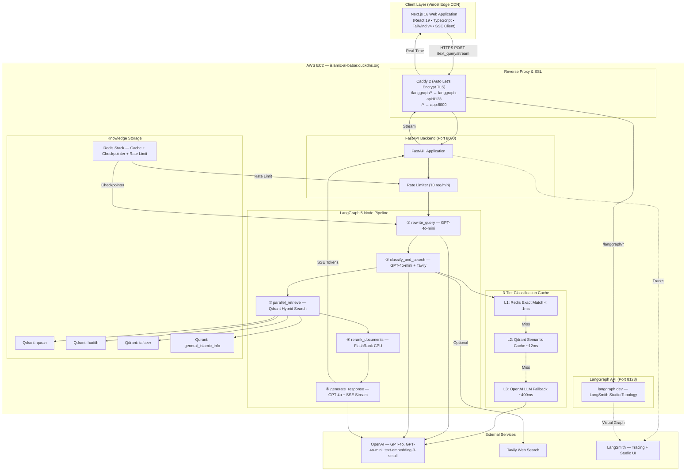

# 🕌 ILM AI — Islamic Knowledge Assistant

<div align="center">

[](https://python.org)
[](https://fastapi.tiangolo.com)
[](https://langchain-ai.github.io/langgraph/)
[](https://nextjs.org)
[](https://react.dev)
[](https://qdrant.tech)
[](https://redis.io)
[](https://docker.com)
[](https://aws.amazon.com)
[](https://vercel.com)
[](https://smith.langchain.com)

**A production-grade, multi-source Retrieval-Augmented Generation (RAG) platform grounded in the Qur'an, Hadith, Tafsir, and Scholarly Islamic Knowledge.**

*Featuring a stateful 5-node LangGraph pipeline, 3-tier semantic caching, hybrid vector search with BM25, cross-encoder reranking, real-time SSE token streaming, persistent conversation memory via Redis, and full LangSmith observability — deployed on AWS with automated HTTPS.*

🌐 **Live Demo:** [ilm-ai-amber.vercel.app](https://ilm-ai-amber.vercel.app)

</div>

---

## 📋 Table of Contents

- [Engineering Highlights](#-engineering-highlights)
- [System Architecture](#-system-architecture)
- [The 5-Node LangGraph Pipeline](#-the-5-node-langgraph-pipeline)
- [Knowledge Base & Islamic Data Sources](#-knowledge-base--islamic-data-sources)
- [3-Tier Semantic Caching Engine](#-3-tier-semantic-caching-engine)
- [Hybrid Vector Search](#-hybrid-vector-search)
- [Cross-Encoder Reranking](#-cross-encoder-reranking)
- [Real-Time SSE Streaming](#-real-time-sse-streaming)
- [Conversation Memory & Session Management](#-conversation-memory--session-management)
- [LangSmith Observability & Live Graph](#-langsmith-observability--live-graph)
- [Frontend Architecture](#-frontend-architecture)
- [Infrastructure & Deployment](#-infrastructure--deployment)
- [Concurrency & Scaling Design](#-concurrency--scaling-design)
- [Circuit Breakers & Resilience](#-circuit-breakers--resilience)
- [Project Structure](#-project-structure)
- [Quickstart & Local Setup](#-quickstart--local-setup)
- [API Reference](#-api-reference)
- [Evaluation](#-evaluation)
- [Technical Design Q&A](#-technical-design-qa)

---

## ⚡ Engineering Highlights

| Feature | Implementation |
|:---|:---|
| **5-Node Stateful Pipeline** | LangGraph `StateGraph` with `AsyncRedisSaver` checkpointer for persistent multi-turn history |
| **Hybrid Vector Search** | OpenAI dense embeddings + BM25 sparse vectors (FastEmbed) fused via Reciprocal Rank Fusion (RRF) |
| **Cross-Encoder Reranking** | FlashRank offline CPU reranker — no GPU, no API cost — scores all candidates and keeps top-K per source |
| **3-Tier Semantic Cache** | Redis exact match → Qdrant semantic vector cache → OpenAI LLM fallback; 97%+ latency reduction on hits |
| **Real-Time SSE Streaming** | Token-by-token streaming via `ChatOpenAI.astream()` + FastAPI `StreamingResponse` rendered live in browser |
| **Query Rewriting** | GPT-4o-mini resolves follow-up references ("Tell me more") into standalone queries before retrieval |
| **Intelligent Source Routing** | Query classified across 4 Islamic knowledge collections + optional live Tavily web search |
| **LangSmith Studio** | Dedicated `langgraph-api` container exposes live visual graph topology with per-node latency tracing |
| **Dual LLM Strategy** | GPT-4o-mini for fast classification & rewriting; GPT-4o flagship for final cited Arabic responses |
| **5-Container Production Stack** | `caddy` · `app` · `qdrant` · `redis` · `langgraph-api` orchestrated with Docker Compose |
| **Automated HTTPS** | Caddy reverse proxy with automatic Let's Encrypt TLS — zero certificate management |

---

## 🏗️ System Architecture



---

## 🔁 The 5-Node LangGraph Pipeline

Every user message passes through a deterministic, stateful pipeline compiled as a LangGraph `StateGraph` with a Redis checkpointer that persists conversation history across all turns.

```
rewrite_query → classify_and_search → parallel_retrieve → rerank_documents → generate_response
```

### Node ① — `rewrite_query`
**Model:** GPT-4o-mini &nbsp;|&nbsp; **Cost tier:** Minimal (often zero-cost)

Resolves ambiguous follow-up questions by reading the last N conversation turns from `LangGraphState.chat_history` (stored in Redis via `AsyncRedisSaver`) and rewriting the user's message into a fully self-contained, standalone query.

- **Zero-cost fast path:** If `chat_history` is empty (first message of a session), the node copies the raw query directly — no LLM call.
- **Sliding window:** Only the last `CHAT_HISTORY_MAX_TURNS` turns are included to keep the rewrite prompt compact and cheap.
- **Structured output:** Uses `QueryRewriteSchema` (Pydantic) to guarantee a clean, typed standalone query string.

> *Example:* "What did He say about that?" → "What did the Prophet ﷺ say about patience during illness according to Hadith?"

---

### Node ② — `classify_and_search`
**Model:** GPT-4o-mini + Tavily &nbsp;|&nbsp; **Cost tier:** Low (usually cache hit)

Determines **where to look** — which Islamic knowledge collections are relevant — and optionally triggers a live web search for time-sensitive queries.

- **Source classification:** Routes queries to one or more of: `quran`, `hadith`, `tafseer`, `general_islamic_info`.
- **3-Tier cache lookup:** Avoids LLM classification on repeated or semantically similar queries (see [Caching Engine](#-3-tier-semantic-caching-engine)).
- **Tavily web search:** Invoked concurrently alongside classification via `ThreadPoolExecutor` when the query touches recent fatwas, contemporary Islamic events, or questions outside the vector database.
- **Graceful degradation:** If `TAVILY_API_KEY` is not set or Tavily fails, web search is silently disabled — the pipeline continues with vector retrieval only.

---

### Node ③ — `parallel_retrieve`
**Tool:** Qdrant hybrid search &nbsp;|&nbsp; **Cost tier:** None (self-hosted)

Executes simultaneous semantic searches across all selected Qdrant collections using a `ThreadPoolExecutor(max_workers=8)`.

- **Hybrid search:** Each collection query combines dense vectors (OpenAI `text-embedding-3-small`, 1536-dim) and sparse BM25 vectors (FastEmbed `Qdrant/bm25`) fused with **Reciprocal Rank Fusion (RRF)**.
- **True parallelism:** All selected collections are searched at the same time — latency stays flat regardless of how many sources are queried.
- **Per-source retrieval limits** (`SOURCE_RETRIEVE_LIMITS`): Fetches 3–4× more candidates than needed (e.g. 18 hadith, 15 quran, 15 tafseer, 20 general) to give the reranker a rich pool.
- **Metadata preserved:** Source URLs, Surah numbers, Hadith collection names, narrator chains, and Tafsir attributions are all carried through document metadata.

---

### Node ④ — `rerank_documents`
**Tool:** FlashRank (offline CPU cross-encoder) &nbsp;|&nbsp; **Cost tier:** Zero

Scores every retrieved candidate document against the standalone query using a cross-encoder relevance model and keeps only the highest-quality results.

- **Offline execution:** FlashRank runs a CPU cross-encoder entirely locally — no network latency, no API cost.
- **Per-source top-K filtering** (`SOURCE_FINAL_LIMITS`): Keeps top 3 Quran verses, top 5 Hadiths, top 2 Tafsir passages, top 6 general knowledge documents.
- **Precision over recall:** Even if 60+ candidates are retrieved, only the most semantically precise documents reach the LLM — preventing hallucination from low-quality context.

---

### Node ⑤ — `generate_response`
**Model:** GPT-4o flagship &nbsp;|&nbsp; **Cost tier:** Standard

Synthesizes the reranked documents into a grounded, scholarly Islamic answer.

- **Authentic Arabic text:** Includes Arabic script for Quranic verses and Du'as.
- **Full citations:** Every claim is cited with Surah name + Ayah number, Hadith collection + narrator, or Tafsir author.
- **Scholarly constraints:** Prompt instructs the model to never fabricate — if the retrieved context does not cover the question, it explicitly states the limitation.
- **SSE token streaming:** Uses `ChatOpenAI.astream()` and LangGraph's native `graph.astream(stream_mode=["updates","messages"])` — tokens are yielded to the client in real-time the moment they are generated.
- **Post-processing:** Strips redundant "Sources & References" trailing sections to keep the rendered UI clean.

---

## 📚 Knowledge Base & Islamic Data Sources

Four dedicated Qdrant collections, each with independent vector indexing:

| Collection | Contents | Embeddings | Key Metadata Fields |
|:---|:---|:---|:---|
| **`quran`** | All 114 Surahs — Arabic text, English translation, transliteration | Dense + BM25 | `surah_name`, `ayah_number`, `En_source_url` |
| **`hadith`** | Sahih Bukhari, Sahih Muslim, Abu Dawood, Tirmidhi, Ibn Majah, Nasa'i | Dense + BM25 | `narrator`, `collection`, `chapter`, `source_url` |
| **`tafseer`** | Classical and contemporary Quran commentary with scholar attribution | Dense + BM25 | `scholar`, `Tafsir_Source`, `ayah_ref` |
| **`general_islamic_info`** | Fiqh principles, Islamic history, practices, lifestyle guidance | Dense + BM25 | `topic`, `source_link`, `category` |

**Ingestion design principles:**
- **1-to-1 record integrity:** Quranic verses and Hadith narrations are stored as discrete, intact semantic units — never arbitrarily split mid-verse or mid-narration.
- **Context fusion for Hadith:** Narrator chain (`sanad`) is prepended to narration text (`matn`) before embedding so vector search matches both speaker and subject matter.
- **Stateful resume:** The ingestion pipeline tracks `points_count` before each batch upload (`BATCH_SIZE=500`). If an ingest job is interrupted, it resumes without duplicating vectors or wasting API credits.

---

## 🗄️ 3-Tier Semantic Caching Engine

Islamic queries from real users are highly repetitive in intent. The caching engine avoids expensive LLM classification calls on every request:

```
Incoming Query
      │
      ▼
┌─────────────────────────────────────┐
│  Layer 1: Redis Exact Match         │  < 1ms  · $0.00
│  Key: exact_cache:<normalized_hash> │
└────────────────┬────────────────────┘
                 │ MISS
                 ▼
┌─────────────────────────────────────┐
│  Layer 2: Qdrant Semantic Cache     │  ~12ms  · $0.00
│  Collection: classification_cache   │
│  Threshold: cosine similarity ≥ 0.85│
└────────────────┬────────────────────┘
                 │ MISS
                 ▼
┌─────────────────────────────────────┐
│  Layer 3: OpenAI LLM Fallback       │  ~400ms · ~$0.0006
│  GPT-4o-mini + Pydantic Structured  │
│  Output → Write-Through to L1 & L2  │
└─────────────────────────────────────┘
```

**Why cache classification intent (not full responses)?**
Full-response caching only helps for exact duplicate queries. Caching *intent classification* means semantically similar but textually different queries ("Hadith on fasting" vs "What did the Prophet ﷺ say about Sawm?") both benefit — the correct collections are identified instantly without an LLM call, while the final synthesized answer remains fresh and contextual per query.

| Tier | Mechanism | Latency | Cost | Fallback |
|:---|:---|:---|:---|:---|
| L1 Exact Match | Redis key-value (TTL: 1h) | **< 1ms** | **$0.00** | In-memory `TTLCache(500, 3600s)` |
| L2 Semantic Cache | Qdrant vector collection (cosine ≥ 0.85) | **~12ms** | **$0.00** | In-memory numpy cosine list (200 items) |
| L3 LLM Fallback | `ChatOpenAI` + `QueryClassificationSchema` | **~400ms** | **~$0.0006** | Writes back to L1 and L2 automatically |

---

## 🔍 Hybrid Vector Search

Each Qdrant collection query combines two complementary retrieval signals:

- **Dense vectors (semantic):** OpenAI `text-embedding-3-small` (1536-dimensional) — captures meaning, intent, and conceptual similarity across paraphrases.
- **Sparse vectors (lexical):** BM25 via FastEmbed `Qdrant/bm25` — captures exact keyword and terminology matches (specific Surah names, Hadith collection names, Arabic terms).
- **Fusion:** Qdrant's native **Reciprocal Rank Fusion (RRF)** merges both ranking signals — documents that score well on both semantic relevance AND lexical match rank highest.

The BM25 model (`Qdrant/bm25`) is loaded once at application startup and shared across all retrieval calls to avoid repeated initialization overhead. Hybrid search is feature-flagged via `HYBRID_SEARCH_ENABLED` and falls back gracefully to dense-only if FastEmbed is unavailable.

---

## 🎯 Cross-Encoder Reranking

After parallel retrieval produces a large candidate pool (up to 60+ documents), FlashRank applies a **cross-encoder** to score each document:

- **Cross-encoder vs bi-encoder:** A cross-encoder jointly encodes the query AND document together, producing a precise relevance score. This is significantly more accurate than cosine similarity alone (which embeds query and document independently).
- **Fully offline:** FlashRank (~67MB model) runs on CPU with no external API call. Model loads once at startup.
- **Cost:** Zero per query — no tokens consumed, no network latency.
- **Effect:** 60 initial candidates are trimmed to ~16 high-precision documents before they reach the LLM, keeping context windows tight and responses accurate.

---

## 🌊 Real-Time SSE Streaming

The primary endpoint `/text_query/stream` returns a `text/event-stream` feed rather than a bulk JSON response:

```http
data: {"status": "searching", "message": "Analyzing and retrieving from Islamic sources..."}

data: {"status": "generating", "message": "Composing response..."}

data: {"token": "In", "done": false}
data: {"token": " Islam,", "done": false}
data: {"token": " patience", "done": false}

data: {"done": true, "full_response": "In Islam, patience (Sabr)...", "session_id": "uuid"}
```

**Implementation details:**
- LangGraph's `graph.astream(stream_mode=["updates","messages"])` streams tokens natively as they are generated.
- FastAPI `StreamingResponse` wraps the async generator — no server-side buffering.
- Caddy is configured with `flush_interval -1` to forward every byte immediately without proxy-side buffering.
- **Status events** (searching/generating) are sent before token streaming begins, so the UI can show a live phase indicator.
- **Why SSE and not WebSockets?** Communication is strictly one-way (one prompt → N tokens). SSE is simpler, HTTP-native, auto-reconnects, and works through all reverse proxies and CDNs without sticky sessions or complex handshaking.

---

## 💬 Conversation Memory & Session Management

Multi-turn conversation context is maintained through two complementary layers:

**Session Identity:**
- Each browser session receives a unique `session_id` (UUID4) on first request.
- The frontend persists this in local state and sends it with every subsequent request.
- The backend attaches it as the LangGraph `thread_id` in `RunnableConfig`.

**Persistent Checkpointing:**
- `LangGraph AsyncRedisSaver` checkpointer stores the complete `LangGraphState` (including `chat_history`) in Redis after every node execution.
- Conversation history survives container restarts, process crashes, and server reboots — as long as the Redis data volume is preserved.
- `rewrite_query` reads the last N turns from this checkpointed state to provide context-aware query rewriting at minimal cost.
- The checkpointer is initialized in the FastAPI `lifespan` async context manager and cleanly torn down on shutdown via `teardown_graph()`.

---

## 🔬 LangSmith Observability & Live Graph

**Production Tracing:**
- Every pipeline execution is traced to LangSmith with full node-level latency, token counts, and input/output payloads.
- Enabled via `LANGCHAIN_TRACING_V2=true` at application startup when `LANGCHAIN_API_KEY` is present.
- The `@traceable` decorator wraps key service methods for granular sub-trace visibility inside each node.

**LangSmith Studio — Live Visual Graph:**
- A dedicated `langgraph-api` Docker container runs `langgraph dev --host 0.0.0.0 --port 8123` using the same application Dockerfile (no separate image needed).
- `langgraph.json` maps `./services/langgraph_service.py:graph` to expose the compiled graph topology.
- The module-level `graph = _build_graph_for_studio()` export is a topology-only compile (no checkpointer) that is safe for synchronous import-time use.
- Caddy proxies `https://<domain>/langgraph/*` → `langgraph-api:8123`, solving the HTTPS/mixed-content browser block so LangSmith Studio can connect securely.

```
Studio URL: https://smith.langchain.com/studio/?baseUrl=https://islamic-ai-babar.duckdns.org/langgraph
```

---

## 🎨 Frontend Architecture

The frontend is a fully custom-built application with a calm, scholarly aesthetic inspired by classical Islamic typography.

**Tech Stack:**

| Layer | Technology |
|:---|:---|
| Framework | Next.js 16 (App Router) |
| UI Library | React 19 |
| Language | TypeScript |
| Styling | Tailwind CSS v4 |
| Hosting | Vercel Edge CDN |
| HTTP / Streaming | Native `fetch` + `ReadableStream` SSE decoder |
| Markdown | `react-markdown` + `remark-gfm` |

**Components & Features:**

| Component | Features |
|:---|:---|
| **`Sidebar.tsx`** | Collapsible two-column drawer with tabs: New Chat, Conversation History, Bookmarks, Topics, Settings. Daily Quranic reflection quote at the bottom. |
| **`Header.tsx`** | Live backend connection pulse indicator (green / amber / red). Dark ↔ light mode toggle. Version badge. Branding. |
| **`MessageBubble.tsx`** | Full Markdown rendering (`react-markdown` + GFM). Automatic RTL detection for Arabic script. Collapsible source citations drawer. Copy-to-clipboard. Message actions bar. |
| **`InputBar.tsx`** | Auto-resizing textarea. Submit on Enter (Shift+Enter for newline). Disabled state during active streaming. |
| **`TypingIndicator.tsx`** | Animated three-dot phase indicator showing live pipeline status: "Analyzing sources…" → "Composing response…" |
| **`WelcomeScreen.tsx`** | Topic suggestion cards (Prayer, Fasting, Marriage, Quran, etc.) to guide new users. |

**Additional frontend features:**
- **Dark / Light mode:** Instant toggle with smooth CSS variable transitions and persistent user preference.
- **Zero layout shift streaming:** Auto-scrolling viewport synchronized with the progressive Markdown token feed and a live pulsing cursor.
- **Conversation history:** Sessions listed in sidebar with auto-generated titles.
- **Bookmarks:** Save any AI response for future reference.
- **Topic tagging:** Conversations grouped by Islamic topic category.
- **Backend health indicator:** Live green pulse when FastAPI is reachable; amber/red when offline.

---

## 🚀 Infrastructure & Deployment

**AWS EC2 — Backend Stack:**

All backend services run as a Docker Compose stack of 5 containers on a single EC2 instance:

| Container | Image / Build | Role |
|:---|:---|:---|
| `caddy-ssl` | `caddy:2-alpine` | Reverse proxy, automatic Let's Encrypt TLS, path-based routing |
| `islamic-chatbot-api` | Local Dockerfile | FastAPI backend + LangGraph pipeline |
| `qdrant` | `qdrant/qdrant:latest` | Self-hosted vector database |
| `redis` | `redis/redis-stack-server:latest` | Cache + rate limiter + session checkpointer |
| `langgraph-api` | Local Dockerfile | LangGraph dev server for LangSmith Studio |

**Caddy routing rules:**
```
/langgraph/*  →  langgraph-api:8123  (strips prefix, proxies for LangSmith Studio)
/*            →  app:8000            (FastAPI catch-all)
```

**Vercel — Frontend:**
- Next.js 16 app deployed to Vercel's global Edge CDN.
- `NEXT_PUBLIC_API_URL` points to `https://islamic-ai-babar.duckdns.org`.

**Domain & TLS:**
- Free dynamic DNS via DuckDNS (`islamic-ai-babar.duckdns.org`).
- Caddy manages TLS certificate issuance and renewal automatically via Let's Encrypt ACME — no manual certificate work.

**Memory management on EC2:**
- 2GB Linux swapfile on EBS to prevent OOM kills on small instances.
- Redis configured with `256MB` LRU memory cap.
- Qdrant uses disk-backed mmap storage — vectors are not fully loaded into RAM.
- Next.js build and SSR offloaded entirely to Vercel — EC2 only runs Python processes.

**Health checks:**
- `qdrant` and `redis` containers have Docker `healthcheck` directives.
- The `app` container has `depends_on: condition: service_healthy` for both — it only starts after both are confirmed ready.

---

## ⚙️ Concurrency & Scaling Design

The application handles 50+ concurrent users through:

| Concern | Solution |
|:---|:---|
| **Classification concurrency** | `ThreadPoolExecutor(max_workers=4)` — prevents blocking the async event loop during sync OpenAI calls |
| **Retrieval concurrency** | `ThreadPoolExecutor(max_workers=8)` — all Qdrant collections searched in parallel |
| **Rate limiting** | `fastapi-limiter` enforces 10 requests/minute per client IP via Redis sliding window |
| **Async event loop** | Full `async/await` from HTTP layer through LangGraph stream — no blocking I/O on the main thread |
| **Redis connection pool** | `max_connections=50` on classification cache Redis client |
| **Session isolation** | Each user's state is keyed by unique `session_id` / LangGraph `thread_id` — no shared mutable state between users |
| **Response caching** | Classification cache means repeated/similar queries skip LLM calls entirely — saves latency and cost at scale |

---

## 🛡️ Circuit Breakers & Resilience

The system degrades gracefully on infrastructure failures rather than crashing:

| Failure Scenario | Automatic Fallback |
|:---|:---|
| Redis unreachable at startup | L1 cache falls back to in-memory `TTLCache(maxsize=500, ttl=3600)` |
| Qdrant semantic cache unavailable | L2 cache falls back to in-memory numpy cosine list (200 items) |
| Tavily API key missing or request fails | Web search silently disabled; pipeline continues with vector retrieval |
| BM25 / FastEmbed not installed | Hybrid search disabled; falls back to dense-only retrieval automatically |
| LangGraph stream error | Error caught per-session; yields a graceful error SSE event to the client |
| Container startup ordering | Docker `depends_on` with `condition: service_healthy` ensures Qdrant and Redis are ready before app starts |

---

## 📂 Project Structure

```
new-advance-islamic-chatbot/
│
├── application.py              # FastAPI app: lifespan, CORS, rate limiter, SSE & sync endpoints
├── Dockerfile                  # Multi-stage backend Docker build
├── docker-compose.yaml         # Local dev: app, qdrant, redis, langgraph-api
├── docker-compose.prod.yaml    # Production: + caddy reverse proxy with auto SSL
├── Caddyfile                   # Caddy routing: /langgraph/* + /* with flush_interval -1
├── langgraph.json              # LangGraph config: graph export path + port 8123
├── requirements.txt            # Pinned Python dependencies
├── .env.example                # Environment variable template
│
├── services/
│   ├── langgraph_service.py    # 5-node LangGraph pipeline, astream, module-level graph export
│   ├── openai_service.py       # 3-tier caching engine, LLM calls, embeddings, query rewrite
│   ├── qdrant_service.py       # Qdrant client, hybrid search (dense + BM25 + RRF), ingestion
│   ├── rerank_service.py       # FlashRank cross-encoder reranking wrapper
│   └── prompt_templates.py     # System prompts: classification, rewrite, Arabic response
│
├── schemas/
│   ├── data_classes/
│   │   └── langraph_state.py        # LangGraphState TypedDict with all pipeline fields
│   ├── routes/
│   │   └── text_query.py            # FastAPI request schema (query + session_id)
│   └── structured_outputs/
│       ├── query_classification.py  # Pydantic schema for GPT-4o-mini classification output
│       └── query_rewrite.py         # Pydantic schema for standalone query rewrite output
│
├── backend/
│   └── vector_store/
│       ├── document_loader.py  # Custom IslamicJSONLoader, heterogeneous schema detection
│       ├── ingest.py           # Stateful ingestion orchestrator, batched upload, resume support
│       └── storage/            # Raw Islamic source datasets (not committed — large binary files)
│
├── utils/
│   ├── config.py               # Pydantic BaseSettings: all env vars with typed defaults
│   └── custom_logger.py        # Structured console + rotating file logger
│
├── evaluation/                 # RAGAS evaluation scripts and metric reports
│
├── frontend/                   # Next.js 16 application (deployed separately to Vercel)
│   ├── src/
│   │   ├── app/
│   │   │   ├── layout.tsx           # Root layout, Google Fonts, global metadata
│   │   │   ├── page.tsx             # Chat orchestrator: sessions, SSE consumer, state
│   │   │   └── globals.css          # Design tokens, typography, dark/light theme variables
│   │   ├── components/
│   │   │   ├── Header.tsx           # Live health pulse, dark mode toggle, branding
│   │   │   ├── Sidebar.tsx          # History, Bookmarks, Topics, Settings + Quranic quote
│   │   │   ├── MessageBubble.tsx    # Markdown + Arabic RTL render, citations, copy action
│   │   │   ├── InputBar.tsx         # Auto-resize textarea, submit on Enter
│   │   │   ├── TypingIndicator.tsx  # Animated phase status display
│   │   │   └── WelcomeScreen.tsx    # Topic suggestion cards for new users
│   │   └── lib/
│   │       ├── api.ts               # sendQuery, sendQueryStream (SSE decoder), healthCheck
│   │       └── types.ts             # TypeScript interfaces for API responses and app state
│   ├── package.json
│   └── Dockerfile                   # Frontend container for local Docker dev
│
└── qdrant_storage/             # Persisted Qdrant vector data (Docker volume mount)
```

---

## 🚀 Quickstart & Local Setup

### Prerequisites
- Docker & Docker Compose v2
- Node.js 18+ (for frontend-only development)
- Python 3.11+ (for bare-metal backend development)
- OpenAI API Key (required)
- Tavily API Key (optional — enables live web search)
- LangSmith API Key (optional — enables tracing + Studio)

### Option A: Full Stack with Docker (Recommended)

```bash
# 1. Clone the repository
git clone https://github.com/babar-ai/new_advance_islamic_chatbot.git
cd new_advance_islamic_chatbot

# 2. Configure environment variables
cp .env.example .env
# Edit .env with your keys:
#   OPENAI_API_KEY=sk-proj-...
#   TAVILY_API_KEY=tvly-...             (optional)
#   LANGCHAIN_API_KEY=lsv2_pt-...      (optional)
#   LANGCHAIN_TRACING_V2=true           (optional)
#   LANGCHAIN_PROJECT=islamic-chatbot   (optional)

# 3. Start all services
docker compose up -d --build

# 4. Access the application
# Chat UI:           http://localhost:3000
# FastAPI Docs:      http://localhost:8000/docs
# Qdrant Dashboard:  http://localhost:6333/dashboard
# LangSmith Studio:  https://smith.langchain.com/studio/?baseUrl=http://localhost:8123
```

### Option B: Bare Metal Development

```bash
# 1. Start infrastructure services
docker run -d --name qdrant -p 6333:6333 \
  -v $(pwd)/qdrant_storage:/qdrant/storage qdrant/qdrant:latest

docker run -d --name redis -p 6379:6379 redis/redis-stack-server:latest

# 2. Backend
python -m venv .venv
source .venv/bin/activate          # Windows: .venv\Scripts\activate
pip install -r requirements.txt
uvicorn application:application --reload --port 8000

# 3. LangGraph dev server (optional — for LangSmith Studio)
langgraph dev --host 0.0.0.0 --port 8123

# 4. Frontend
cd frontend
npm install
npm run dev                        # http://localhost:3000
```

### Environment Variables

| Variable | Required | Description |
|:---|:---|:---|
| `OPENAI_API_KEY` | ✅ Yes | GPT-4o + GPT-4o-mini + embeddings |
| `TAVILY_API_KEY` | Optional | Live web search for recent fatwas and contemporary queries |
| `LANGCHAIN_API_KEY` | Optional | LangSmith tracing + Studio live graph |
| `LANGCHAIN_TRACING_V2` | Optional | Set `true` to enable LangSmith tracing |
| `LANGCHAIN_PROJECT` | Optional | LangSmith project name |
| `QDRANT_URL` | Auto-set | `http://qdrant:6333` in Docker; `http://localhost:6333` locally |
| `REDIS_HOST` | Auto-set | `redis` in Docker; `localhost` locally |
| `HYBRID_SEARCH_ENABLED` | Optional | Set `true` to enable BM25 sparse hybrid search |
| `CHAT_HISTORY_MAX_TURNS` | Optional | Number of past turns used for query rewriting |

---

## 📡 API Reference

### `POST /text_query/stream` — Primary Streaming Endpoint

Returns a real-time `text/event-stream` of pipeline status and LLM tokens.

```json
// Request body
{
  "query": "What does Islam teach about honesty in business?",
  "session_id": "optional-uuid-for-continued-conversation"
}
```

```http
// Response stream events
data: {"status": "searching", "message": "Analyzing and retrieving from Islamic sources..."}
data: {"status": "generating", "message": "Composing response..."}
data: {"token": "Islam", "done": false}
data: {"token": " commands", "done": false}
data: {"done": true, "full_response": "Islam commands utmost honesty...", "session_id": "uuid"}
```

---

### `POST /text_query` — Synchronous Fallback Endpoint

Returns the complete response as a JSON payload. Rate limit: **10 requests per minute per IP**.

```json
// Response
{
  "status": "success",
  "query": "...",
  "message": "Full response text...",
  "session_id": "uuid"
}
```

---

### `GET /` — Health Check

```json
{"status": "ok", "version": "1.3"}
```

---

## 📊 Evaluation

The `evaluation/` directory contains RAGAS-based evaluation scripts measuring:

- **Faithfulness:** Does the answer stay grounded in the retrieved context?
- **Answer Relevancy:** How well does the answer address the question?
- **Context Precision / Recall:** Are the right Islamic documents being retrieved?

RAGAS v0.2.15 is pinned for compatibility with `langchain-community`. Run evaluations with a HuggingFace `datasets` test set against the `/text_query` endpoint.

---

## 🧠 Technical Design Q&A

<details>
<summary><b>Why a 5-node pipeline instead of a single LLM call?</b></summary>

Each node has a single, testable responsibility. This makes the system inspectable, debuggable, and independently improvable. For example: the reranker can be swapped without touching retrieval; the query rewriter is skipped entirely on first-turn messages at zero cost; and each node's latency is independently traced in LangSmith. A single monolithic LLM call would be impossible to optimize or observe at this granularity.

</details>

<details>
<summary><b>Why FlashRank offline instead of a cloud reranking API?</b></summary>

Cloud reranking APIs (e.g. Cohere Rerank) add ~200–400ms network latency and per-query cost. FlashRank's CPU cross-encoder runs in ~50–150ms locally with zero API cost and zero network dependency. For a pipeline serving Islamic queries where the candidate pool is 16–60 documents, this is the optimal trade-off between quality and speed.

</details>

<details>
<summary><b>Why hybrid search (dense + BM25) instead of dense-only?</b></summary>

Pure dense semantic search can miss queries that use exact Islamic terminology (e.g. "Surah Al-Baqarah", "Sahih Bukhari 1234", "Wudu"). BM25 catches these lexical matches precisely. RRF fusion gives the highest ranks to documents that score well on both signals — semantically relevant AND lexically matching — which is critical for a domain with precise religious vocabulary in both Arabic and English.

</details>

<details>
<summary><b>Why cache classification intent instead of full LLM responses?</b></summary>

Full-response caching only helps for exact duplicate queries. Caching *classification intent* (which collections to search) benefits all semantically similar queries. The synthesis step remains fresh and contextual per query while avoiding the 400ms+ LLM classification overhead for common intent patterns.

</details>

<details>
<summary><b>Why SSE over WebSockets for streaming?</b></summary>

LLM generation is strictly unidirectional (one prompt → N tokens). SSE uses standard HTTP, auto-reconnects natively, works through all proxies without sticky sessions, and is fully compatible with Caddy and Vercel's edge layer. WebSockets would add connection state complexity and sticky session requirements with no benefit for this one-way use case.

</details>

<details>
<summary><b>How does the system stay within EC2 memory limits?</b></summary>

Next.js is offloaded to Vercel so EC2 only runs Python processes. Redis has a 256MB LRU memory cap. Qdrant uses disk-backed mmap storage. A 2GB Linux swapfile on the EBS volume protects against OOM kills. Peak observed EC2 RSS stays under ~500MB with all 5 containers running.

</details>

---

## 👨‍💻 Author

**Babar Raheem**
- GitHub: [@babar-ai](https://github.com/babar-ai)
- LinkedIn: [Babar Raheem](https://linkedin.com/in/babar-raheem)

---

<div align="center">
  <sub>Built with reverence, precision, and modern software engineering practices.</sub><br/>
  <sub>🤍 For the Ummah — Seek · Learn · Apply</sub>
</div>
